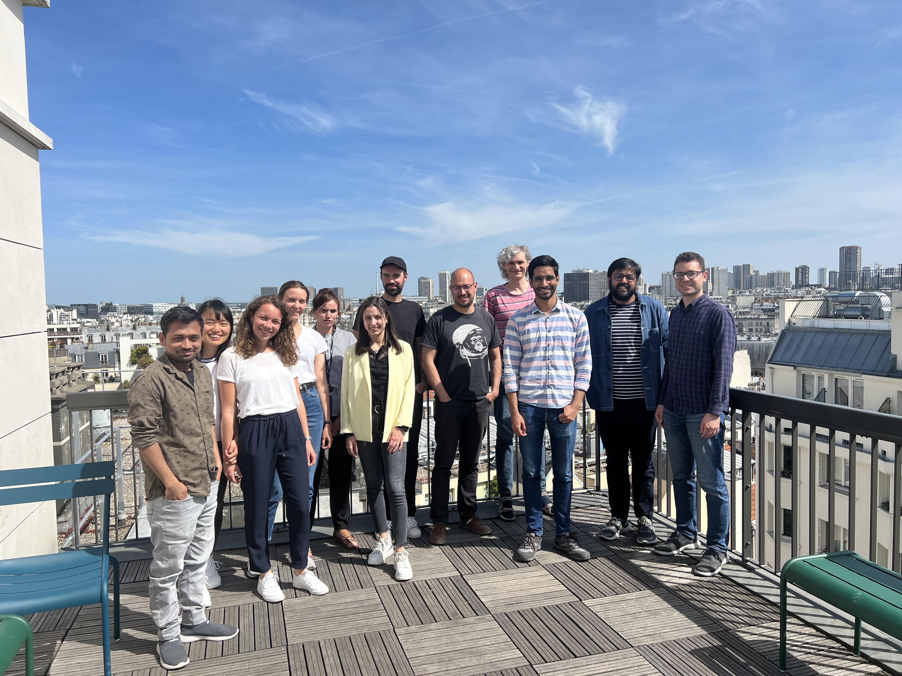

  
  <!-- You can add more images or repeat the same ones multiple times -->



<!-- 
 -->
<!--    -->
<!--     <h2>{{ group.name }}</h2> -->
<!--     
 -->
<!--       
 -->
<!--          -->
<!--          -->
<!--           
 -->
<!--              -->
<!--             
 -->
<!--               <h3>{{ member.name }}</h3> -->
<!--               <\!-- 
{{ member.email }}
 -\-> -->
<!--               
{{ member.content }}
 -->
<!--             
 -->
<!--           
 -->
<!--          -->
<!--       
 -->
<!--     
 -->
<!--    -->
<!-- 
 -->

  
    <h2>{{ group.name }}</h2>
    

      

        
        
          

          

            <a class="research-link" href="{{ member.url | relative_url }}">
            
              <h3>{{ member.name | escape }}</h3>
            </a>
            
{{ member.description }}

          

          

        
      

    

  

